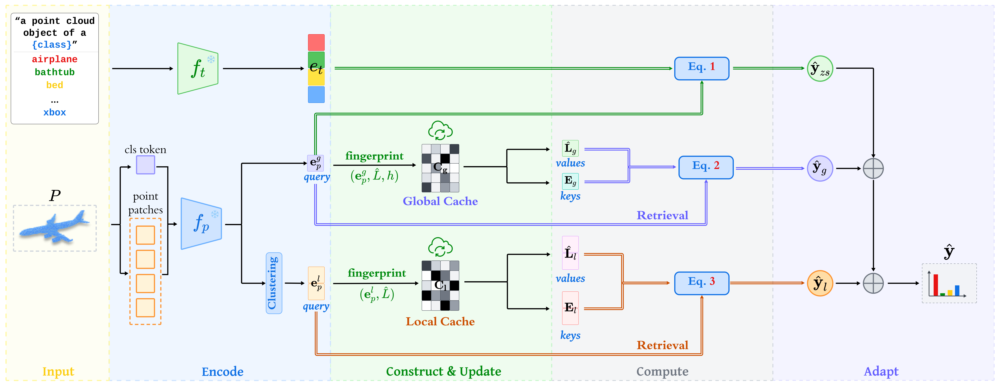
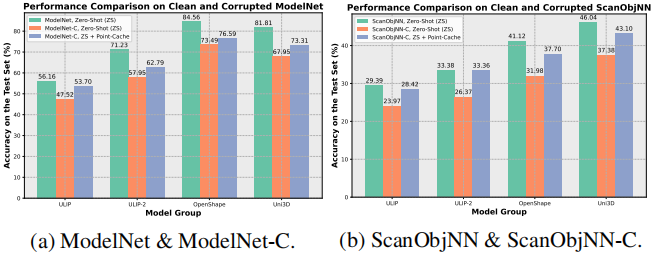

# Point-Cache
This repository is the official implementation of the CVPR 2025 paper ["Point-Cache: Test-time Dynamic and Hierarchical Cache for Robust and Generalizable Point Cloud Analysis"](https://github.com/auniquesun/Point-Cache).

## Overview


This paper proposes a general solution to enable point cloud recognition models to handle distribution shifts at test time. Unlike prior methods, which rely heavily on training data—often inaccessible during online inference—and are limited to recognizing a fixed set of point cloud classes predefined during training, we explore a more practical and challenging scenario: adapting the model solely based on online test data to recognize both previously seen classes and novel, unseen classes at test time. To this end, we develop **Point-Cache**, a hierarchical cache model that captures essential clues of online test samples, particularly focusing on the global structure of point clouds and their local-part details. Point-Cache, which serves as a rich 3D knowledge base, is dynamically managed to prioritize the inclusion of high-quality samples. Designed as a plug-and-play module, our method can be flexibly integrated into large multimodal 3D models to support open-vocabulary point cloud recognition. Notably, our solution operates with efficiency comparable to zero-shot inference, as it is entirely training-free. Point-Cache demonstrates substantial gains across 8 challenging benchmarks and 4 representative large 3D models, highlighting its effectiveness. 

## Motivation


In recent years, 3D sensors such as LiDARs and RGB-D cameras have been widely adopted in robotics and electric vehicles for their ability to provide reliable 3D geometry measurements. Point clouds are among the most direct data formats produced by these 3D sensors. Although remarkable progress has been made in 3D point cloud recognition, the success is primarily based on the assumption that the test data and the model training data are identically distributed. However, this assumption is frequently violated in real-world scenarios due to complex geometries, as well as sensing and processing errors. 

In practice, a majority of models remain vulnerable to distribution shifts, such as out-of-distribution (OOD) samples, data corruptions, and more. As shown in the above figure, notable performance gaps (\eg, 11+\%) occur when models are tested on clean (ModelNet) versus corrupted data (ModelNet-C). And similar observations applies to  ScanObjNN vs. ScanObjNN-C. 

## Environment
### Package Setup
* [dassl](https://github.com/auniquesun/dassl)
* Ubuntu 23.10
* Python 3.8.16
* PyTorch 1.12.0
* CUDA 11.6
* torchvision 0.13.0
* timm 0.9.16
* pueue & pueued 2.0.4

```sh
  # NOTE The option 1 is recommended. A complete package list is provided in `env.yaml`
  # option 1: create conda virtual env by your own
  conda create -n pointcache python=3.8.16
  codna activate pointcache
  # install torch
  pip install torch==1.12.0+cu116 torchvision==0.13.0+cu116 --extra-index-url https://download.pytorch.org/whl/cu116
  # install dassl
  git clone https://github.com/auniquesun/dassl
  cd dassl/
  python setup.py develop # (no need to re-build if the source code is modified)

  # option 2: create conda virtual env according to the provided env.yaml
  conda env create -f env.yaml
  codna activate pointcache
```

`pueue` is a shell command management software, we use it for scheduling the model training & evaluation tasks, please refer to the [official page](https://github.com/Nukesor/pueue) for installation and basic usage. We recommend this tool because under its help you can run the experiments at scale thus save your time.

**NOTE:** We provide a complete package list of our virtual environment in `env.yaml`. Feel free to check whether you need a specific package. If it is the case, run the following command to install it, _e.g._ 
```sh
  pip install h5py==3.10.0 plyfile==1.0.3
```

### Pre-trained Weights
1. In the experiments, we use the following models as the baselines. The pre-trained weights of these models can be found in their public GitHub repositories. 
    * [ULIP](https://huggingface.co/datasets/auniquesun/Point-PRC/tree/main/pretrained-weights/ulip)
    * [ULIP-2](https://huggingface.co/datasets/auniquesun/Point-PRC/tree/main/pretrained-weights/ulip-2)
    * [OpenShape](https://github.com/Colin97/OpenShape_code/)
    * [Uni3D](https://github.com/baaivision/Uni3D)

    - **NOTE:** 
        1. ULIP-2 uses the same [text encoder](https://huggingface.co/datasets/auniquesun/Point-PRC/tree/main/pretrained-weights/ulip/image-text-encoder) as ULIP
        2. For OpenShape, we use the [pointbert-vitg14-rgb](https://huggingface.co/OpenShape/openshape-pointbert-vitg14-rgb/tree/main) version
            - For text encoder in OpenShape, we use [CLIP-ViT-bigG-14-laion2B-39B-b160k](https://huggingface.co/laion/CLIP-ViT-bigG-14-laion2B-39B-b160k) from **huggingface laion**
        3. For Uni3D, we use the [uni3d-g](https://huggingface.co/BAAI/Uni3D/tree/main/modelzoo/uni3d-g) version
            - For text encoder in Uni3D, we use [eva02_enormous_patch14_plus_clip_224.laion2b_s9b_b144k](https://huggingface.co/timm/eva02_enormous_patch14_plus_clip_224.laion2b_s9b_b144k) from **huggingface timm**

2. Make a folder called `weights` under this project and save the pre-trained weights into this folder. 

### Datasets
1. The folder structure of used datasets should be organized as follows.
```sh
    /path/to/Point-Cache
    |----data # placed in the same level as `runners`, `scripts`, etc. 
        |----modelnet_c
        |----sonn_c
            |----obj_bg
            |----obj_only
            |----hardest
        |----modelnet40
        |----scanobjnn
        |----omniobject3d
            |----1024
            |----4096
            |----16384
        |----objaverse_lvis
    |----runners
    |----scripts
    ...
```

2. You can find the download links of above datasets from our [huggingface dataset repository](https://huggingface.co/datasets/auniquesun/Point-Cache). 


## Usage
Point-Cache is totally *training-free* and can operate in comparable efficiency with zero-shot inference of large multi-modal 3D models. Users can reproduce the results presented in the paper by directly inferring on the test datasets, as explained below. 

### General instructions
1. To evaluate the performances of a large 3D model (_e.g.,_ Uni3D) on a specific dataset (_e.g.,_ ModelNet-C), you will use script files like 
    - `scripts/eval_zs_infer.sh`
    - `scripts/eval_model_with_global_cache.sh`
    - `scripts/eval_model_with_hierarchical_caches.sh`. 

2. Each script has a number of input arguments, as illustrated in corresponding file. 
    - Use `scripts/eval_zs_infer.sh` to produce the *zero-shot* results of large 3D models.
    - Use `scripts/eval_model_with_global_cache.sh` to produce the results of large 3D models with our _global_ cache. 
    - Use `scripts/eval_model_with_hierarchical_caches.sh` to produce the results of large 3D models with our _hierarchical_ cache. 

3. Users need to check the script files and the project code to understand the meaning of all used arguments for accurate usage. The definition and usage of these arguments follow a regular pattern and are easy to understand.
    - _Take it easy!_

4. In the following, we present several examples to explain the usage and reproduce the results of the paper. 

### Robustness evaluation on _ModelNet-C_
1. This part corresponds to the experiments in Section 4.2 (Table 1). 

2. Taking **ULIP-2** with `global cache` as an example, to get the results on ModelNet-C, you can run the following command. 
    ```sh
    ./scripts/eval_model_with_global_cache.sh 0 ulip weights/ulip/pointbert_ulip2.pt modelnet_c obj_only add_global_2 1024 vitg14 ulip2 global so_obj_only_9
    ```
    - Explanations to the command-line arguments
        - `0` indexes the GPU id to run the experiment
        - `ulip` means the large 3D model is chosen from [ULIP, ULIP-2]
        - `weights/ulip/pointbert_ulip2.pt` is the path to pretrained weights to the large 3D model
        - `modelnet_c` is the dataset name
        - `add_global_2` is one of 7 corruption types in ModelNet-C, other options are
            - `add_local_2`
            - `dropout_global_2`
            - `dropout_local_2`
            - `rotate_2`
            - `scale_2`
            - `jitter_2`
        - `1024` indicates the number of points for each point cloud object
        - `ulip2` specifies the ulip version, options are 
            - `ulip1`
            - `ulip2`
        - `global` decides the cache type, options are
            - `global`
            - `hierarchical`
        - **NOTE:** arguments not mentoined here do not affect the running results, users can check the script file and code for details

3. You can get the results of other large 3D models by replacing the argument `ulip` with other values, _e.g.,_
    - `ulip` $\rightarrow$ `openshape`
    - `ulip` $\rightarrow$ `uni3d`
    - **NOTE:** also remember to replace other arguments related to this large 3D model

4. You can get the results of other cache types by replacing the argument `global` with other values, _e.g.,_
    - `global` $\rightarrow$ `hierarchical`
    - **NOTE:** also remember to replace other arguments related to this cache type

### Robustness evaluation on _ScanObjNN-C_
1. This part corresponds to the experiments in Section 8.1 (Table 5, 6, and 7). 

2. Taking **OpenShape** with `hierarchical cache` as an example, to get the results on _ScanObjNN-C (the obj\_only split)_, you can run the following command. 
    ```sh
    ./scripts/eval_model_with_hierarchical_caches.sh 0 openshape weights/openshape/openshape-pointbert-vitg14-rgb/model.pt sonn_c obj_only rotate_2 1024 vitg14 ulip2 hierarchial so_obj_only_9
    ```
    - **NOTE:**
        1. `obj_only` indicates the split of _ScanObjNN-C_, feel free to change to other options
            - obj_bg
            - hardest
        2. Users need to check the script file to figure out the meaning of other command-line arguments. Generally, they follow the same/similar usage as those arguments in [Robustness evaluation on _ModelNet-C_](#robustness-evaluation-on-modelnet-c)

3. You can get the results of other large 3D models by replacing the argument `openshape` with other values, _e.g.,_
    - `openshape` $\rightarrow$ `ulip`
    - `openshape` $\rightarrow$ `uni3d`
    - **NOTE:** also remember to replace other arguments related to this large 3D model

4. You can get the results of other cache types by replacing the argument `hierarchical` with other values, _e.g.,_
    - `hierarchical` $\rightarrow$ `global`
    - **NOTE:** also remember to replace other arguments related to this cache type

### Generalization evaluation on _a dataset suite_
1. This part corresponds to the experiments in Section 4.2 (Table 2). 

2. Taking Uni3D with `zero-shot inference` as an example, to get the results on _OmniObject3D (16384 points)_, you can run the following command. 
    ```sh
    ./scripts/eval_zs_infer.sh 0 uni3d weights/uni3d/model.pt omniobject3d obj_only add_global_2 16384 vitg14 ulip2 global so_obj_only_9
    ```
    - **NOTE:**
        1. `omniobject3d` is the dataset name, feel free to change to other options in _the dataset suite_
            - modelnet40
            - scanobjnn
            - objaverse_lvis
        2. Remember to to replace other arguments related to the used dataset 
        3. Users need to check the script file to figure out the meaning of other command-line arguments

3. You can get the results of other large 3D models by replacing the argument `uni3d` with other values, _e.g.,_
    - `uni3d` $\rightarrow$ `ulip`
    - `uni3d` $\rightarrow$ `openshape`
    - **NOTE:** also remember to replace other arguments related to this large 3D model

4. You can refer to `scripts/eval_model_with_global_cache.sh` and `scripts/eval_model_with_hierarchical_caches.sh` on how to obtain the results of large 3D models with global/hierarchical cache.

## Citation
```bibtex
    @inproceedings{sun25pointcache,
        title={Point-Cache: Test-time Dynamic and Hierarchical Cache for Robust and Generalizable Point Cloud Analysis},
        author={Sun, Hongyu and Ke, Qiuhong and Cheng, Ming and Wang, Yongcai and Li, Deying and Gou, Chenhui and Cai, Jianfei},
        booktitle={2025 IEEE/CVF Conference on Computer Vision and Pattern Recognition (CVPR)},
        year={2025}
    }
```

## Acknowledgement
Our implementation is partially inspired by the following projects, thanks to their great work.

1. [Dassl](https://github.com/KaiyangZhou/Dassl.pytorch)
2. [ULIP](https://github.com/salesforce/ULIP)
3. [OpenShape](https://github.com/ZrrSkywalker/PointCLIP)
4. [Uni3D](https://github.com/yangyangyang127/PointCLIP_V2)
5. [TDA](https://github.com/kdiAAA/TDA)

## Contact
If you have any question about our work, please search related issues or create a new one in this repository.